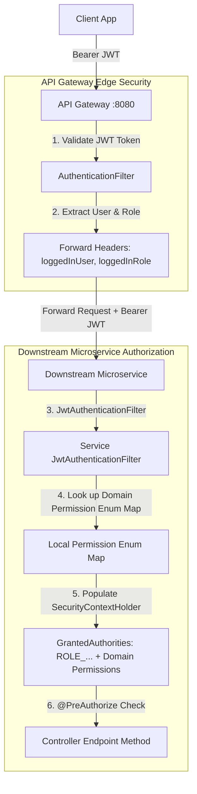
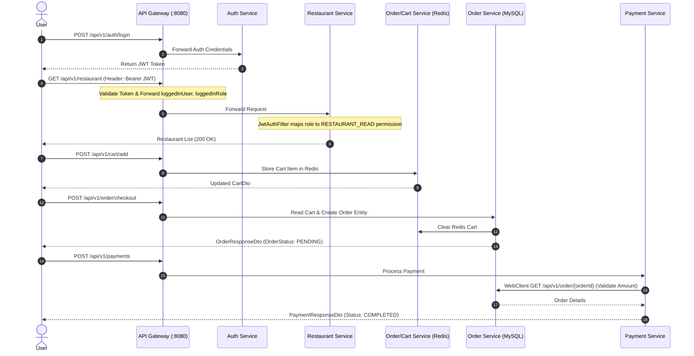

# Microservices Backend API Documentation & Technical Context

This document provides a comprehensive overview of all microservices, API routes, Request/Response DTOs, data models, headers, security architecture, and inter-service communication flows within the Food Delivery Application backend workspace.

---

## Architecture & Security Overview

### 1. 2-Tier Security & Fine-Grained Authorization Flow



- **API Gateway (`api-gateway`)**: Edge entry point on `http://localhost:8080`. Performs basic JWT token validation (integrity & expiration check), extracts `username` and `role`, and forwards `loggedInUser` and `loggedInRole` headers downstream along with the Bearer token.
- **Decoupled Downstream Microservices**: Each downstream microservice owns its domain-specific `Permission` enum and role-permission map (`mukul.<service>.config.Permission`).
- **Domain Authorization**: In each service's `JwtAuthenticationFilter`, the role is extracted and mapped to local domain `Permission` enums. The filter populates `SecurityContextHolder` with fine-grained authorities so endpoints can use `@PreAuthorize("hasAuthority('<PERMISSION_NAME>')")`.
- **Eureka Server (`discovery-service`)**: Service discovery server on `http://localhost:8761`.
- **Auth & User Service (`auth-service`)**: User authentication, registration, JWT generation, and profile management.
- **Restaurant Service (`restaurant-service`)**: Management of restaurants and food menus.
- **Order & Cart Service (`order-service`)**: Redis-backed cart management and MySQL order processing.
- **Payment Service (`payment-service`)**: Payment handling with synchronous `WebClient` order validation.
- **Delivery Service (`delivery-service`)**: Delivery agent assignments and order tracking.

---

## Domain Role-Permission Matrix

| Permission Enum | Description | `CUSTOMER` | `RESTAURANT_OWNER` | `DELIVERY_AGENT` | `ADMIN` | Owning Microservice |
|---|---|:---:|:---:|:---:|:---:|---|
| `RESTAURANT_READ` | View restaurant details & list | ✅ | ✅ | ✅ | ✅ | `restaurant-service` |
| `RESTAURANT_CREATE` | Onboard a new restaurant | ❌ | ✅ | ❌ | ✅ | `restaurant-service` |
| `RESTAURANT_UPDATE` | Edit restaurant details | ❌ | ✅ | ❌ | ✅ | `restaurant-service` |
| `FOODITEM_READ` | View menu and food items | ✅ | ✅ | ✅ | ✅ | `restaurant-service` |
| `FOODITEM_CREATE` | Add new food item to menu | ❌ | ✅ | ❌ | ✅ | `restaurant-service` |
| `FOODITEM_UPDATE` | Update food item details | ❌ | ✅ | ❌ | ✅ | `restaurant-service` |
| `FOODITEM_UPDATE_QUANTITY` | Update stock quantity | ❌ | ✅ | ❌ | ✅ | `restaurant-service` |
| `FOODITEM_DELETE` | Delete food item from menu | ❌ | ✅ | ❌ | ✅ | `restaurant-service` |
| `CART_READ` | View active Redis cart | ✅ | ❌ | ❌ | ✅ | `order-service` |
| `CART_WRITE` | Add/Remove/Clear items in cart | ✅ | ❌ | ❌ | ✅ | `order-service` |
| `ORDER_CREATE` | Place order / checkout cart | ✅ | ❌ | ❌ | ✅ | `order-service` |
| `ORDER_READ` | View order status & history | ✅ | ✅ | ✅ | ✅ | `order-service` |
| `ORDER_UPDATE_STATUS` | Change order status | ❌ | ✅ | ✅ | ✅ | `order-service` |
| `ORDER_READ_STATS` | View order analytics/revenue | ❌ | ✅ | ❌ | ✅ | `order-service` |
| `PAYMENT_CREATE` | Process payment / retry | ✅ | ❌ | ❌ | ✅ | `payment-service` |
| `PAYMENT_READ` | View payment history/status | ✅ | ✅ | ❌ | ✅ | `payment-service` |
| `PAYMENT_UPDATE` | Cancel payment | ✅ | ❌ | ❌ | ✅ | `payment-service` |
| `DELIVERY_MANAGE` | Accept & update delivery status | ❌ | ❌ | ✅ | ✅ | `delivery-service` |
| `USER_READ` | Fetch user profile | ✅ | ✅ | ✅ | ✅ | `auth-service` |
| `USER_UPDATE` | Update user profile | ✅ | ✅ | ✅ | ✅ | `auth-service` |
| `USER_READ_DELIVERY` | List available delivery agents | ❌ | ✅ | ❌ | ✅ | `auth-service` |

---

## Common Structures & Headers

### Common Headers (Gateway Injected)
| Header Name | Type | Description |
|---|---|---|
| `Authorization` | `String` | Bearer JWT token (`Bearer <token>`) |
| `loggedInUser` | `String` | Injected by API Gateway filter representing the authenticated username/email |
| `loggedInRole` | `String` | Injected by API Gateway filter representing the authenticated role |

### Standard Response Envelope (`ApiResponse<T>`)
```json
{
  "success": true,
  "message": "Operation successful",
  "data": { ... }
}
```

---

## 1. Auth & User Microservice (`auth-service`)

Base Gateway Path: `/api/v1/auth` & `/api/v1/user`

### 1.1 `POST /api/v1/auth/register`
- **Description**: Registers a new user account (*Public / Unauthenticated*).
- **Request Body (`UserCredential`)**:
```json
{
  "fullName": "John Doe",
  "username": "johndoe",
  "email": "john@example.com",
  "password": "SecretPassword123",
  "phoneNumber": 9876543210,
  "address": {
    "street": "123 Main St",
    "city": "Metropolis",
    "state": "NY",
    "zipCode": "10001",
    "country": "USA"
  },
  "userRole": "CUSTOMER" // Roles: CUSTOMER, RESTAURANT_OWNER, DELIVERY_AGENT, DELIVERY_PARTNER, ADMIN
}
```
- **Response (`ApiResponse<UserDto>`)**:
```json
{
  "success": true,
  "message": "user registered successfully",
  "data": {
    "id": 1,
    "fullName": "John Doe",
    "username": "johndoe",
    "email": "john@example.com",
    "phoneNumber": 9876543210,
    "address": { ... },
    "userRole": "CUSTOMER"
  }
}
```

### 1.2 `POST /api/v1/auth/login`
- **Description**: Authenticates user and returns a JWT token (*Public / Unauthenticated*).
- **Request Body (`AuthRequest`)**:
```json
{
  "identity": "john@example.com",
  "password": "SecretPassword123"
}
```
- **Response (`ApiResponse<AuthResponse>`)**:
```json
{
  "success": true,
  "message": "Login successful",
  "data": {
    "token": "eyJhbGciOiJIUzI1NiJ9...",
    "username": "johndoe",
    "email": "john@example.com",
    "role": "CUSTOMER"
  }
}
```

### 1.3 `GET /api/v1/user/{id}`
- **Permission Required**: `@PreAuthorize("hasAuthority('USER_READ')")`
- **Description**: Fetches user profile by ID.
- **Headers**: `Authorization`, `loggedInUser`
- **Response**: `ApiResponse<UserDto>`

### 1.4 `PUT /api/v1/user`
- **Permission Required**: `@PreAuthorize("hasAuthority('USER_UPDATE')")`
- **Description**: Updates profile details for logged in user.
- **Request Body**: `UserCredential`
- **Response**: `ApiResponse<UserDto>`

### 1.5 `GET /api/v1/user/delivery`
- **Permission Required**: `@PreAuthorize("hasAuthority('USER_READ_DELIVERY')")`
- **Description**: Returns list of active delivery partners (`List<DeliveryAgent>`).

### 1.6 `GET /api/v1/user/role`
- **Description**: Returns the role string of a user given `?username=...`.

---

## 2. Restaurant Microservice (`restaurant-service`)

Base Gateway Path: `/api/v1/restaurant` & `/api/v1/fooditem`

### 2.1 `POST /api/v1/restaurant`
- **Permission Required**: `@PreAuthorize("hasAuthority('RESTAURANT_CREATE')")`
- **Description**: Creates a new restaurant (Requires `RESTAURANT_OWNER` or `ADMIN`).
- **Request Body (`RestaurantRequestDto`)**:
```json
{
  "name": "Tasty Bites",
  "description": "Authentic Italian & Pizza",
  "address": {
    "street": "456 Food Court",
    "city": "Metropolis",
    "state": "NY",
    "zipCode": "10002",
    "country": "USA"
  },
  "contactInfo": [9876543210]
}
```
- **Response (`ApiResponse<RestaurantResponseDto>`)**: Returns created restaurant details.

### 2.2 `PUT /api/v1/restaurant/{id}`
- **Permission Required**: `@PreAuthorize("hasAuthority('RESTAURANT_UPDATE')")`
- **Description**: Updates restaurant details.

### 2.3 `GET /api/v1/restaurant`
- **Permission Required**: `@PreAuthorize("hasAuthority('RESTAURANT_READ')")`
- **Description**: Returns all registered restaurants (`ApiResponse<List<RestaurantResponseDto>>`).

### 2.4 `GET /api/v1/restaurant/{id}`
- **Permission Required**: `@PreAuthorize("hasAuthority('RESTAURANT_READ')")`
- **Description**: Gets details of a specific restaurant (`ApiResponse<RestaurantResponseDto>`).

### 2.5 `POST /api/v1/fooditem`
- **Permission Required**: `@PreAuthorize("hasAuthority('FOODITEM_CREATE')")`
- **Description**: Creates a new food menu item.

### 2.6 `GET /api/v1/fooditem/{restaurantId}`
- **Permission Required**: `@PreAuthorize("hasAuthority('FOODITEM_READ')")`
- **Description**: Returns all food items belonging to a restaurant (`ApiResponse<List<FoodItemDto>>`).

### 2.7 `GET /api/v1/fooditem`
- **Permission Required**: `@PreAuthorize("hasAuthority('FOODITEM_READ')")`
- **Description**: Paginated list of all food items (`?page=0&size=10`).

### 2.8 `PUT /api/v1/fooditem`
- **Permission Required**: `@PreAuthorize("hasAuthority('FOODITEM_UPDATE')")`
- **Description**: Updates food item details.

### 2.9 `PUT /api/v1/fooditem/quantity`
- **Permission Required**: `@PreAuthorize("hasAuthority('FOODITEM_UPDATE_QUANTITY')")`
- **Description**: Updates stock quantities for food items.

---

## 3. Order & Cart Microservice (`order-service`)

Base Gateway Path: `/api/v1/cart` & `/api/v1/order`

### 3.1 Cart Endpoints (`/api/v1/cart`) - Redis Backend

#### `POST /api/v1/cart/add`
- **Permission Required**: `@PreAuthorize("hasAuthority('CART_WRITE')")`
- **Description**: Adds an item to the user's Redis cart.

#### `GET /api/v1/cart/{userId}`
- **Permission Required**: `@PreAuthorize("hasAuthority('CART_READ')")`
- **Description**: Retrieves the active Redis cart for a user.

#### `DELETE /api/v1/cart/{userId}/item/{foodItemId}`
- **Permission Required**: `@PreAuthorize("hasAuthority('CART_WRITE')")`
- **Description**: Removes an item from the user's cart.

#### `DELETE /api/v1/cart/{userId}`
- **Permission Required**: `@PreAuthorize("hasAuthority('CART_WRITE')")`
- **Description**: Clears the cart for a user.

---

### 3.2 Order Endpoints (`/api/v1/order`)

#### `POST /api/v1/order/checkout`
- **Permission Required**: `@PreAuthorize("hasAuthority('ORDER_CREATE')")`
- **Description**: Converts active Redis cart into persistent DB order.

#### `POST /api/v1/order`
- **Permission Required**: `@PreAuthorize("hasAuthority('ORDER_CREATE')")`
- **Description**: Direct order placement.

#### `GET /api/v1/order/user/{userId}`
- **Permission Required**: `@PreAuthorize("hasAuthority('ORDER_READ')")`
- **Description**: Fetches paginated orders for a specific customer (`userId`) ordered by `orderTime` descending.
- **Query Params**:
  - `status` (*optional* `OrderStatus`: `PENDING`, `ACCEPTED`, `CANCELLED`, `COMPLETED`, `DELIVERED`)
  - `page` (*default* `0`)
  - `pageSize` (*default* `10`)

#### `GET /api/v1/order`
- **Permission Required**: `@PreAuthorize("hasAuthority('ORDER_READ')")`
- **Description**: Paginated list of orders.
- **Query Params**:
  - `userId` (*optional* string filter)
  - `status` (*optional* `OrderStatus` filter)
  - `page` (*default* `0`)
  - `pageSize` (*default* `10`)

#### `PUT /api/v1/order/status`
- **Permission Required**: `@PreAuthorize("hasAuthority('ORDER_UPDATE_STATUS')")`
- **Description**: Updates order status (`PENDING`, `ACCEPTED`, `CANCELLED`, `DELIVERED`).

#### `GET /api/v1/order/stats`
- **Permission Required**: `@PreAuthorize("hasAuthority('ORDER_READ_STATS')")`
- **Description**: Returns order analytics & revenue stats.

---

## 4. Payment Microservice (`payment-service`)

Base Gateway Path: `/api/v1/payments`

### 4.1 `POST /api/v1/payments`
- **Permission Required**: `@PreAuthorize("hasAuthority('PAYMENT_CREATE')")`
- **Description**: Processes payment. Synchronously calls `order-service` via `@LoadBalanced WebClient` to validate order ID and amount.

### 4.2 `GET /api/v1/payments/{paymentId}`
- **Permission Required**: `@PreAuthorize("hasAuthority('PAYMENT_READ')")`
- **Description**: Retrieves status of payment by ID.

### 4.3 `GET /api/v1/payments`
- **Permission Required**: `@PreAuthorize("hasAuthority('PAYMENT_READ')")`
- **Description**: Paginated query of payment records.

### 4.4 `POST /api/v1/payments/{paymentId}/retry`
- **Permission Required**: `@PreAuthorize("hasAuthority('PAYMENT_CREATE')")`
- **Description**: Retries a failed payment.

### 4.5 `POST /api/v1/payments/{paymentId}/cancel`
- **Permission Required**: `@PreAuthorize("hasAuthority('PAYMENT_UPDATE')")`
- **Description**: Cancels a payment transaction.

---

## 5. Delivery Microservice (`delivery-service`)

Base Gateway Path: `/api/v1/delivery`

### 5.1 `POST /api/v1/delivery/{orderId}`
- **Permission Required**: `@PreAuthorize("hasAuthority('DELIVERY_MANAGE')")`
- **Description**: Assigns or creates a delivery task for an order ID.

---

## Complete End-to-End User Flow


